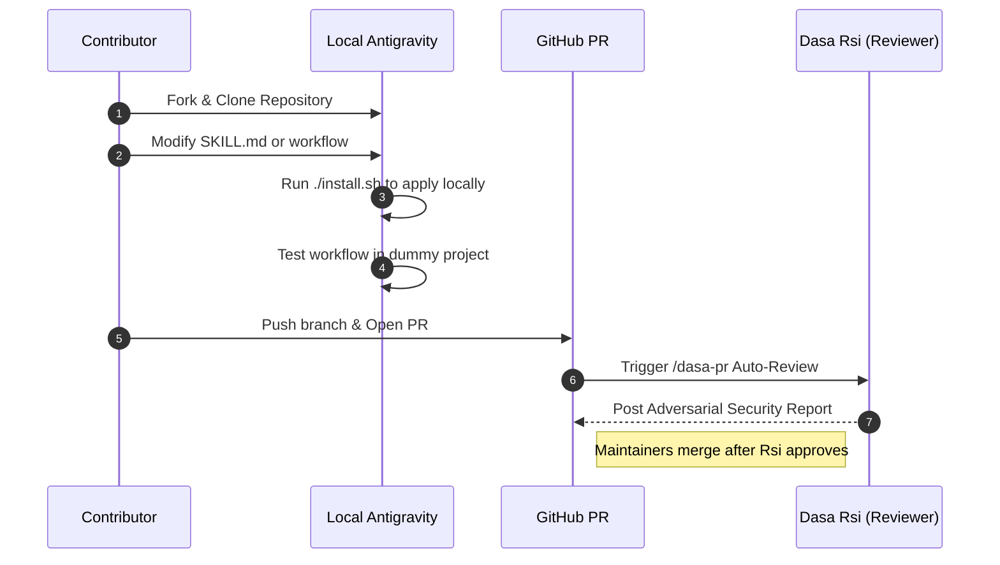

# Contributing to the Dasa Sradha Kit

Welcome! The **Dasa Sradha Kit** transforms the Antigravity IDE into a multi-agent orchestrated environment. We welcome community enhancements, provided they adhere to our strict **Zero-Dependency** and **TOON** architectural rules.

This guide traces the actual execution paths (`install.sh`, `scripts/dasa-init`, etc.) so you understand exactly how your contributions wire into the core system.

---

## 🏗️ 1. Architecture Map

Before writing a new Persona or Workflow, you must understand how Antigravity executes these files.

```mermaid
graph TD
    %% Node Styles
    classDef default fill:#2d333b,stroke:#6d5dfc,stroke-width:2px,color:#e6edf3;
    classDef sub fill:#161b22,stroke:#30363d,stroke-width:1px,color:#e6edf3;

    subgraph User Workspace
    U(User Input: /slash-command)
    end
    
    subgraph Dasa Sradha Global (~/.gemini/)
    W(workflows/dasa-*.md)
    S(skills/dasa-*/SKILL.md)
    E(scripts/dasa-init)
    end

    U -->|1. Triggers| W
    W -->|2. Assumes Identity| S
    E -->|3. Bootstraps| U

    %% Apply Subgraph Styles
    class User Workspace sub;
    class Dasa Sradha Global sub;
    
    linkStyle default stroke:#8b949e,stroke-width:2px;
```

### Component Breakdown
| Component | Path | Function |
| :--- | :--- | :--- |
| **Workflows** | `workflows/` | The global Slash Commands (e.g., `/dasa-e2e`). These tell Antigravity *when* to trigger an action. |
| **Skills** | `skills/` | The Persona rulesets (e.g., `dasa-mpu/SKILL.md`). These tell Antigravity *how* to behave. |
| **Bootstrapper** | `scripts/dasa-init` | The local initializer. It copies workflows into the current directory. |

---

## 🔄 2. The Contribution Lifecycle

We enforce a strict Git workflow to ensure changes do not break the 10-Persona orchestration loop.



### Step-by-Step Guide
1. **Fork & Branch**: Create a feature branch (`feature/my-new-persona`).
2. **Develop**:
   - If adding a Workflow: Create `workflows/dasa-my-feature.md`. You **must** also add it to the `WORKFLOW_FILES` array in `scripts/dasa-init` so it gets installed for end-users.
   - If adding a Skill: Create `skills/dasa-my-persona/SKILL.md`. Ensure it defines allowed native tools (e.g., `browser_subagent`).
3. **Local Testing**:
   - Run `./install.sh` from your cloned root. This forcefully injects your code into `~/.gemini/skills/` and `~/.gemini/workflows/`.
   - Open a test folder, run `/dasa-init`, and ensure your changes propagate correctly.
4. **Pull Request**: Submit to the `master` branch. Dasa Rsi will automatically review it if a maintainer runs `/dasa-pr`.

---

## ⚖️ 3. Core Development Principles (NON-NEGOTIABLE)

1. **Zero-Dependency Native Execution**
   - **DO NOT** require `npm install -g something` unless explicitly approved (e.g., `osgrep`).
   - Use Antigravity's built-in APIs (`browser_subagent`, `run_command`, `grep_search`).
   - *(Citation: See `/dasa-e2e` for how we use native browsers instead of Playwright)*.

2. **TOON (Token Optimized Object Notation)**
   - When generating internal state data, output raw JSON/YAML blocks.
   - **DO NOT** use conversational filler ("Here is your data:"). It wastes expensive LLM context tokens.
   - *(Citation: See `dasa.config.toon` generation in `/dasa-init`)*.

3. **Bahasa Indonesia Final Output**
   - The internal reasoning in your `SKILL.md` must be written in English for maximum LLM comprehension.
   - The final output presented to the user (e.g., updates in `.artifacts/walkthrough.md`) MUST instruct the Persona to reply in Bahasa Indonesia.

Thank you for contributing to the native Antigravity ecosystem!
