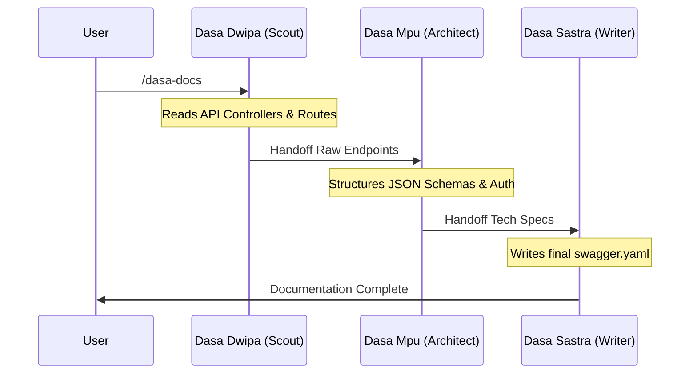

# 🏛️ Dasa Sradha Architecture

This document serves as the definitive technical reference for the **Dasa Sradha Kit**, an Agentic Framework natively integrated with the Antigravity IDE. It explains the system's design decisions, core components, and operational mechanics.

---

## 1. Executive Summary
The Dasa Sradha Kit transforms the generalized Antigravity IDE into a highly specialized, multi-agent development environment. By splitting the context window across 10 distinct "Personas," the framework mitigates LLM hallucination, drastically improves large-scale codebase navigation, and eliminates the need for expensive third-party web testing dependencies. It is built entirely on native Shell (`.sh`) and Markdown (`.md`) scripts, maintaining a **Zero-Dependency** footprint.

---

## 2. Architecture Overview
Dasa Sradha operates on a **Phase-Gated Orchestration Model**. Instead of a single AI prompt executing an entire feature, work is divided across specialized agents via Slash Commands.

### System Boundaries & Inputs
*   **Input**: User Slash Commands (e.g., `/dasa-plan`)
*   **Context Mechanism**: The `.agent/dasa.config.toon` file dictates the rules of engagement.
*   **Execution Engine**: Antigravity's native `browser_subagent` and terminal `run_command` protocols.

### High-Level Flow
1.  **Bootstrapping**: The user runs `/dasa-init` to generate the TOON configuration and initialize the `.artifacts/` persistence layer.
2.  **Planning Phase**: Dasa Patih (The Architect) generates an actionable task list (`task.md`).
3.  **Execution Loop**: The user triggers `/dasa-start-work`. The Orchestrator automatically reads `task.md`, selects an appropriate Persona (e.g., Dasa Nala for frontend), routes them to the correct Git workspace, and executes native tools.
4.  **Memory Compression**: Upon completion, `/dasa-sync` condenses conversational history into a dense `architecture-state.md` vault.

---

## 3. Design Decisions (The "Why")

### Why "Zero-Dependency"?
**Decision**: Rely solely on Antigravity's native APIs rather than Node/Python packages.
**Rationale**: Third-party wrapper CLI tools (like external Playwright adapters) frequently break when LLM APIs update. By using Antigravity's native `browser_subagent` for E2E testing (`/dasa-e2e`), we guarantee 100% uptime and exact environment parity.

### Why "TOON" (Token Optimized Object Notation)?
**Decision**: Use ultra-dense JSON/YAML block hybrid structures instead of conversational Markdown for state management.
**Rationale**: LLM context windows are expensive and finite. Conversational text (e.g., "Here is the database schema for the user table...") wastes tokens. TOON strips all pleasantries, allowing the AI to load three times as much architectural context per message.

### Why Use an External Semantic Search (`osgrep`)?
**Decision**: Wrap `osgrep` natively inside `semantic-scan.sh` for Dasa Dwipa (The Scout).
**Rationale**: Traditional `grep_search` relies on exact string matches. If a developer searches for "payment logic" but the code says `processTransaction()`, `grep` fails. `osgrep` uses local vector embeddings, allowing Dasa Dwipa to "see" the semantic meaning of code, significantly reducing hallucinations.

---

## 4. Core Components (The Dasa Sradha Personas)

The system divides labor among 10 discrete roles. Key operational personas include:

*   **Dasa Dwipa (The Scout)**: Responsible for reading schemas, extracting `osgrep` embeddings, and generating component maps.
*   **Dasa Patih (The Mastermind)**: The central planner. Patih reads Dwipa's recon and structures the `task.md` execution loop.
*   **Dasa Mpu (The Architect)**: The backend specialist. Handles databases, APIs, and complex logic gating.
*   **Dasa Nala (The Builder)**: The frontend UI specialist. Relies on `.design-memory/mockups/` native vision to match layouts to Figma exports.
*   **Dasa Rsi (The Analyst)**: The security specialist. Executes native adversarial reviews on active GitHub branches using `gh pr diff`.
*   **Dasa Indra (The QA Investigator)**: The testing specialist. Native operator of the `browser_subagent` for End-to-End checks.

---

## 5. Data Flow & Orchestration Mechanics

### Meta-Project Routing
Modern ecosystems often separate Repositories (e.g., React frontend + Laravel backend). The Dasa Sradha Orchestrator manages this natively:

1.  User starts work on a UI component.
2.  The Orchestrator reads `workspaces.frontend` from `dasa.config.toon`.
3.  The system automatically executes `cd ./frontend-repo` *before* loading Dasa Nala's Persona.

### The Collaborative API Pipeline (`/dasa-docs`)
When generating complex OpenAPI or Postman collections, a single agent will often miss edge cases. Dasa Sradha uses a 3-agent orchestration chain:

---

## 6. Implementation Notes

### Security Model
The entire framework operates locally on the user's machine via the IDE. The only external integration is the GitHub CLI (`gh`) for the `/dasa-pr` workflow, which strictly obeys the user's local `~/.config/gh/hosts.yml` authentication tokens. No data is sent to a centralized Dasa Sradha telemetry server.

### Extensibility
The framework is designed to absorb community tools seamlessly via the `awesome-antigravity` implementation standard. Users can map external paths inside `dasa.config.toon` (`external_skills:` array), granting Dasa Personas explicit read-access to new community behaviors.
