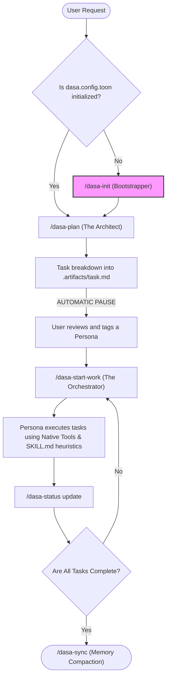

# How Dasa Sradha Works (The Architecture Guide)

Dasa Sradha is not just a collection of prompts. It is a **Zero-Dependency Agentic Framework** built specifically to maximize the native capabilities of the **Antigravity IDE**.

This document explains what Antigravity is, why Dasa Sradha was built, and the core architectural concepts that make this Kit so powerful.

---

## 🌌 What is Antigravity?
[Antigravity](https://antigravity.google/) is an advanced, AI-native IDE. Unlike traditional editors that just offer autocomplete, Antigravity operates on **Agentic Workflows**. It has native subagents (like the `browser_subagent`), native memory access, and native artifact generation.

### Why Dasa Sradha Makes It Better
Out of the box, Antigravity is incredibly powerful but highly generalized. If you give it a massive task (e.g., "Build a SaaS platform"), it might get lost in the weeds or run out of context window.

**The Dasa Sradha Kit solves this by introducing Orchestrated Division of Labor.**
Instead of one AI trying to do everything, Dasa Sradha splits Antigravity into **10 distinct Personas** (The Scout, The Architect, The Builder, etc.). The Kit provides strict `.md` instruction files (Skills) and Slash Command Workflows to ensure the AI hands off tasks perfectly without losing context.

---

## 🧠 Core Architectural Concepts

### 1. The Zero-Dependency Philosophy
Dasa Sradha runs almost entirely on Markdown (`.md`) files and native Shell scripts (`.sh`). There are no massive Python packages or Node dependencies to install. It leverages the tools Antigravity *already has*.
*   **Need E2E tests?** We don't use Playwright; we run `/dasa-e2e` to trigger Antigravity's native `browser_subagent`.
*   **Need to search code?** We use the native `grep_search` or the lightweight `osgrep` embedding wrapper.

### 2. Token Optimized Object Notation (TOON)
LLM context windows are expensive. Instead of writing verbose YAML configurations, Dasa Sradha saves state in `.agent/dasa.config.toon`. This format strips out conversational filler, leaving only dense, machine-readable JSON/YAML structs. This saves massive amounts of tokens for actually writing code.

### 3. Meta-Project Auto-Routing
Modern apps are often split across multiple repositories (e.g., a React frontend repo and a Laravel backend repo sitting side-by-side). 
Dasa Sradha handles this natively via the `workspaces` key in `dasa.config.toon`. When **Dasa Nala** builds a UI component, the Orchestrator automatically `cd ./frontend` before she starts.

### 4. The Semantic Engine
Large codebases break standard text searching (`grep`). Dasa Sradha integrates `osgrep` to give **Dasa Dwipa (The Scout)** native embedding-based semantic sight. He can run `./semantic-scan.sh "database connection pool"` and instantly find the logic, even if those exact words aren't used in the code.

### 5. Infinite Memory (Session Compaction)
LLMs eventually forget things in long chats. The `/dasa-sync` workflow commands **Dasa Patih** to read the current chat history and aggressively compress the architectural decisions into a single `.agent/memory/architecture-state.md` vault. You can clear your chat window entirely, ping Patih tomorrow, and he will instantly remember everything.

---

## 🗺️ The Orchestration Lifecycle

Here is the native lifecycle of a feature request:

