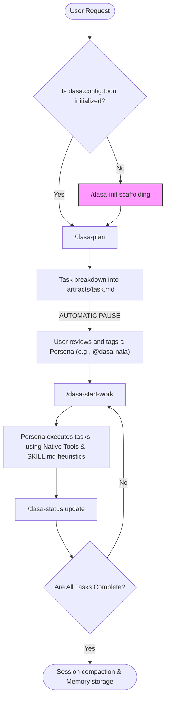

# How Dasa Sradha Works

Dasa Sradha uses a **Persona-based Orchestration** model natively integrated with Antigravity IDE. It splits complex software workflows into 10 distinct personas and defines clear, phase-gated slash commands governed by a strict `dasa.config.toon` file.

## 🗺️ Orchestration Flowchart

Here is how the automated lifecycle works from request to completion:



## 💻 Execution Pseudo-Code (Easy Lang)

```text
// Step 1: Initialize the brain
IF project NOT HAS "dasa.config.toon":
    RUN /dasa-init
    CREATE folder ".artifacts/" AND ".agent/memory/"

// Step 2: The Planning Phase
ON USER RUN "/dasa-plan request":
    READ "dasa.config.toon" rules
    GENERATE "implementation_plan.md"
    PAUSE and WAIT FOR USER APPROVAL

// Step 3: The Execution Phase
ON USER RUN "/dasa-start-work":
    LOOP over tasks in "task.md":
        READ "max-power-core.md" heuristics
        CHECK if "task" needs Design Memory OR Web Search 
        EXECUTE single task natively
        RUN local tests / linting
        CHECK task off in "task.md"

    // Step 4: Infinite Memory
    IF Context Window > SAFE_LIMIT:
        RUN compact-session.sh
        SAVE learned rules to ".agent/memory/decisions.md"
```
