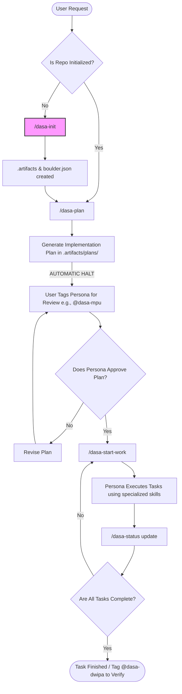

# Dasa Sradha Kit

Multi-agent orchestration framework Uses a workflows-only architecture for task planning, strict continuation, and Indonesian persona-based skill routing.

---

## 📦 What Dasa Installs

Dasa Sradha supports two initialization models: Global Installation and Local Repository Bootstrapping.

<details>
<summary><strong>Global Installation (<code>~/.gemini/</code>)</strong></summary>

Running `./install.sh` from this repository installs these tools globally to your environment:
- `~/.gemini/scripts/dasa-init`: Bootstrap script for initializing new repositories.
- `~/.gemini/scripts/dasa-uninstall`: Global kit uninstaller script.
- `~/.gemini/antigravity/workflows/dasa-sradha-kit/`: Master workflow templates that power the `/dasa-` slash commands natively in the IDE.
- `~/.gemini/antigravity/skills/`: The 10 distinct persona skill definitions, mapped as `dasa-*/SKILL.md` folders.
</details>

<details>
<summary><strong>Local Project Bootstrapping (<code>/dasa-init</code>)</strong></summary>

Running the `/dasa-init` slash command inside a repository creates the local framework state:
- `.dasa-sradha`: Activation guard marker file to prevent accidental runs elsewhere.
- `.agent/workflows/`: Local copies of the workflow templates.
- `.artifacts/`: The designated directory for state management, task evidence files, and output logs.
- `.artifacts/plans/`: Generates structured markdown execution plans.
- `boulder.json`: Sets the default system prompts and operational configurations for the IDE.
</details>

---

## ⚙️ How Dasa Works

Dasa Sradha uses a **Persona-based Orchestration** model natively integrated with Antigravity IDE. It splits complex software workflows into 10 distinct personas (e.g., Architect, Implementer, Debugger, Reviewer) and defines clear, phase-gated slash commands. 

All actions are tracked and synchronized using `.artifacts/` and `boulder.json`. Work is explicitly planned via the `/dasa-plan` workflow, automatically paused for review by the operating persona (like `@dasa-mpu` or `@dasa-patih`), and then executed sequentially via `/dasa-start-work`. This guarantees high fidelity in code generation and structured planning over spontaneous, unorganized AI edits.

---

## 🔄 Available Workflows

| Slash Command | File | Description |
|---------------|------|-------------|
| `/dasa-init` | `dasa-init.md` | Bootstraps the current repository with `.artifacts/`, `.agent/`, and `boulder.json`. |
| `/dasa-plan` | `dasa-plan.md` | Generates a structured execution plan. **Stops automatically** for Persona review. |
| `/dasa-start-work` | `dasa-start-work.md` | Executes the next task on the plan using the chosen persona's specific abilities. |
| `/dasa-status` | `dasa-status.md` | Displays the current progress and active task state from the plan. |
| `/dasa-uninstall` | `dasa-uninstall.md` | Removes all local marker files, configuration, and workflows from the repository. |

---

## 🚀 How to Use It

### Option A: Manual Installation

1. **Install Globally:**
   ```bash
   git clone https://github.com/TudeOrangBiasa/dasa-sradha-kit.git
   cd dasa-sradha-kit
   ./install.sh
   ```
2. **Initialize Your Project:** Open your target project in Antigravity IDE and run:
   ```text
   /dasa-init
   ```

### Option B: AI Agent Installation (Recommended)

You can ask Antigravity (or another advanced agent) to install the kit for you by copying and pasting this prompt:

> "Please install the Dasa Sradha Kit globally for me. Clone the repository at `https://github.com/TudeOrangBiasa/dasa-sradha-kit.git` into a temporary directory if needed, run the `./install.sh` script, and then initialize it in the current repository using the `/home/$USER/.gemini/scripts/dasa-init` script."

---

### Using the Workflows

1. **Plan Your Work:** Ask the system to create a plan for your feature:
   ```text
   /dasa-plan "Refactor the authentication module to use JWT"
   ```
2. **Assign a Persona:** Once the plan is generated, it will pause. Tag the appropriate persona to review and execute it:
   ```text
   @dasa-mpu please review the plan and /dasa-start-work
   ```
3. **Check Status:** Keep track of what's happening or resume a paused workflow:
   ```text
   /dasa-status
   ```

---

## 🗺️ Dasa Execution Flowchart

The following flowchart illustrates the lifecycle of a task within the Dasa Sradha framework.



---

## 🎭 The 10 Personas (Dasa Sradha)

The framework is divided into 10 domains of expertise. Mentioning them with `@dasa-<name>` triggers their unique skill logic:

1. **Patih**: High-level system architect.
2. **Mpu**: Core feature implementer and coder.
3. **Nala**: Orchestrator and delegation manager.
4. **Rsi**: Deep debugger and root-cause analyst.
5. **Sastra**: Librarian, documentation, and research.
6. **Widya**: Risk analyst and edge-case specialist.
7. **Indra**: Investigator and system explorer.
8. **Dharma**: Guardian of ethics, security, and standards.
9. **Kala**: Time, dependency, and priority manager.
10. **Dwipa**: Code reviewer and QA validator.

---
*License: MIT*
